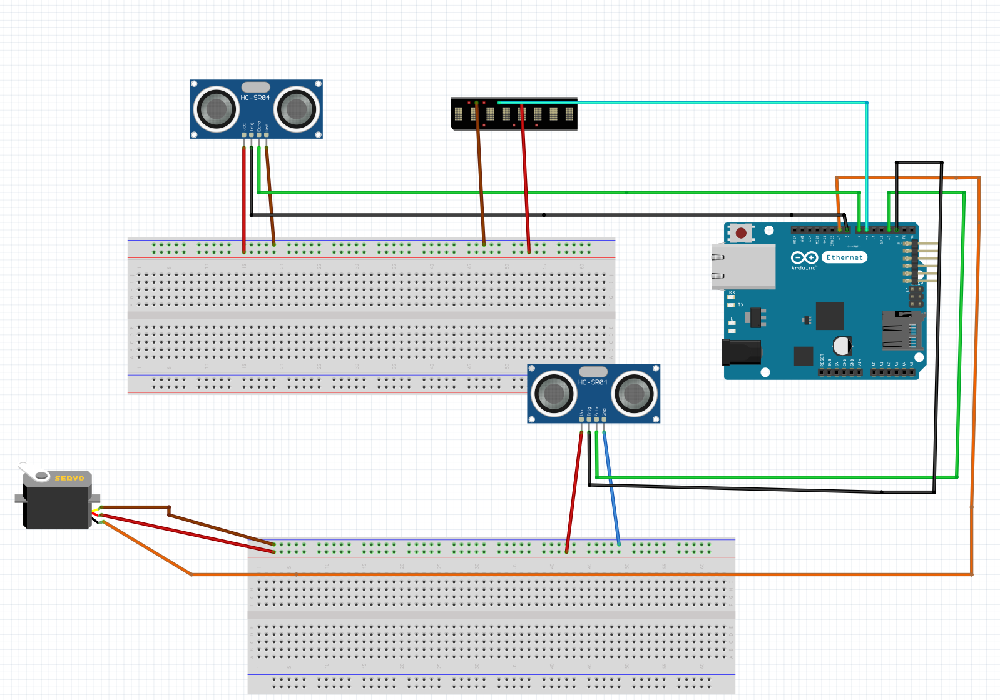

# Smart Bin

# Overview 

This project build during the course - Making, Designing & Building Connected Sensor

# Libararies and define pin 

the main component is Arduino uno as a microcontroler that have 14 digital pins.
For this project i use 6 digital pin 

The pins: 
+ A. servo which is pin 9
+ B. define trigPin2 8
+ C. define echoPin2 7
+ D. #define trigPin1 2
+ E. #define echoPin1 3
+ F. the last pin is for the LED neo Pixel pin 6

The Libararies : 
1. Servo.h
2. Adafruit_NeoPixel.h

# Arcitecture 
 

the
# video demonstrations

# future features
# Reference 

Automatic Trash Bin - https://www.instructables.com/Automatic-Trash-Bin/ - 
Smart Trash Bin - https://create.arduino.cc/projecthub/4DMakers/smart-trash-bin-425536
